# ColonyCountingML
## Introduction

The traditional and preferred method for quantifying microbe populations is by colony enumeration. This process involves serially diluting liquefied samples, plating the samples on media plates, and counting the resulting colony-forming units. Assuming each colony-forming unit originates from a single microbe, the number of microbes can then be back-calculated. We aimed to improve upon previous results, listed in the references section, through the use of boosting.

(1). Research technologies typically count the number of colonies by hand, which can reach as high as hundreds per plate. The task of hand-counting is tedious and prone to error.

(2). To reduce this burden, we aim to develop a program to digitally enumerate the number of colony-forming units using images of the sampled media plates.

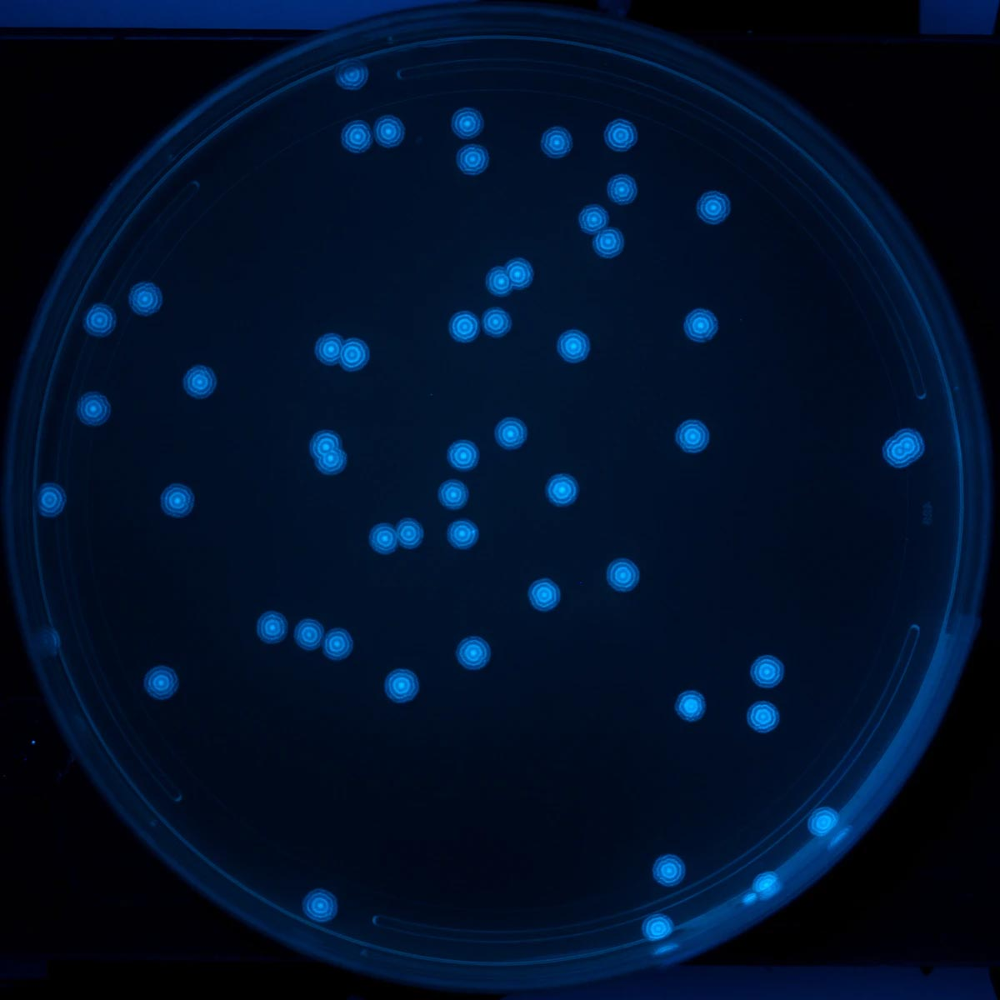

## Dataset

The dataset consists of two groups, training data, and testing data. The training dataset was generated via a colony-plate image generator. Colony variables that were tuned include the radius, xy position, and colony count. Radiuses were generated along a standard normal distribution to best emulate real data. Random noise and shapes were added to prevent the model from overfitting. The data set used to test the program consists of 32 real plate images taken at a group member’s lab. 

| Real plate image | Generated image |
| --- | --- |
| 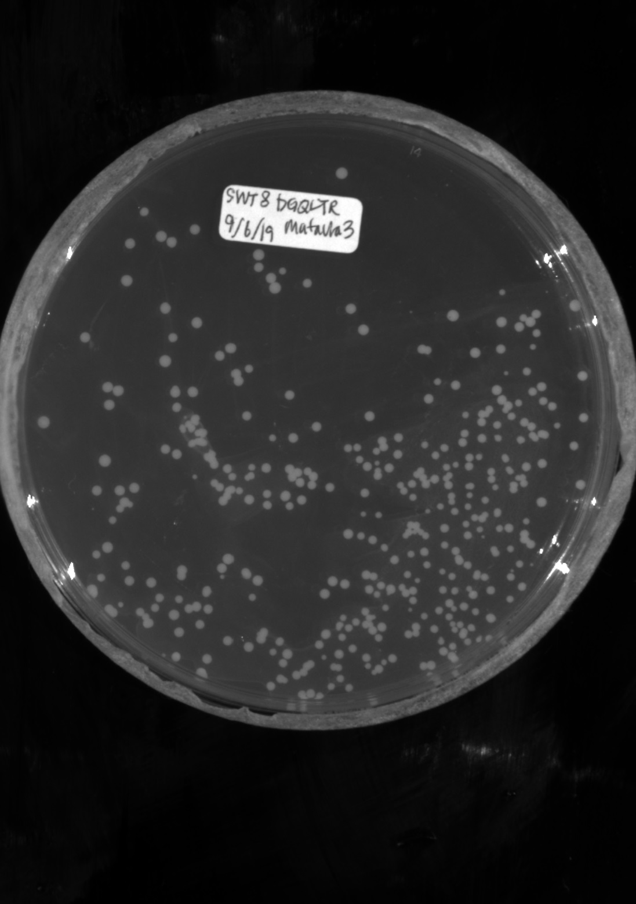 | 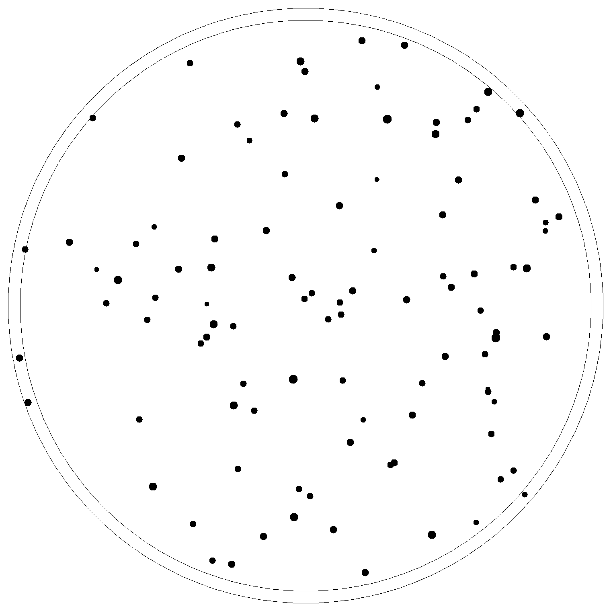 |

## Preprocessing

The testing data is pre-processed in 3 steps to simplify features. 

(1).  Convert each image to binary to create a clear distinction between the plate and colony pixels. We used Otsu’s method to determine the optimal threshold value for each image.

(2).  Remove the petri dish perimeter so that only the microbe colonies appear in the foreground (white). Connected units of white pixels that exceeded a certain size in proportion to the image size were classified as the petri-dish pixels and removed from the final output via masking

(3).  Resize all images to a standard 400 x 400 pixels in order to run the algorithm under a reasonable time constraint. The computer generated images in the training set do not need to be pre-processed since they were created in the proper format to begin with. 

| Real plate image | Binary image | Binary image without petri|
| --- | --- | --- |
| 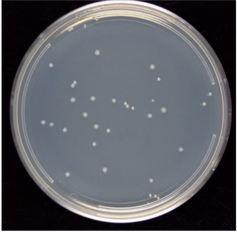 | 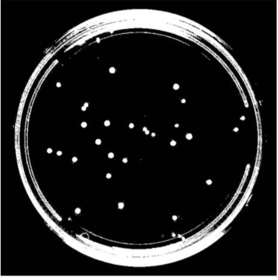 |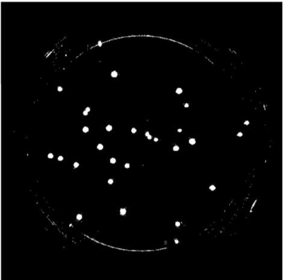 |

## Methods

We first use Open CFU to get the number of colonies in each petri dish as the actual colony number. Here is the link http://opencfu.sourceforge.net/. 
Then, from our preprocessed data, we will attempt two methods to quantify the number of colonies:

### KMeans

Using our preprocessed data, we get the array of pixel values of preprocessed image. Since the image only contains white and black colors, the pixel value only contains 0 and 255. Based on  the image’s background, we cluster the image with the x and y values of each pixel with value 255(if colonies are white) or value 0(if colonies are black). According to the Open CFU, the maximal colony number is 1200, therefore, we set the maximal k to be 1500 and use a for loop to find the optimal k value with elbow criteria. The k value is the number of colonies on the petri dish. 

The plot image shown below is the k value plot of a colony image with 33 colonies. From the plot we can see that the optimal k value is around 3 and 4, which means the estimated colony number is around 30 to 40.

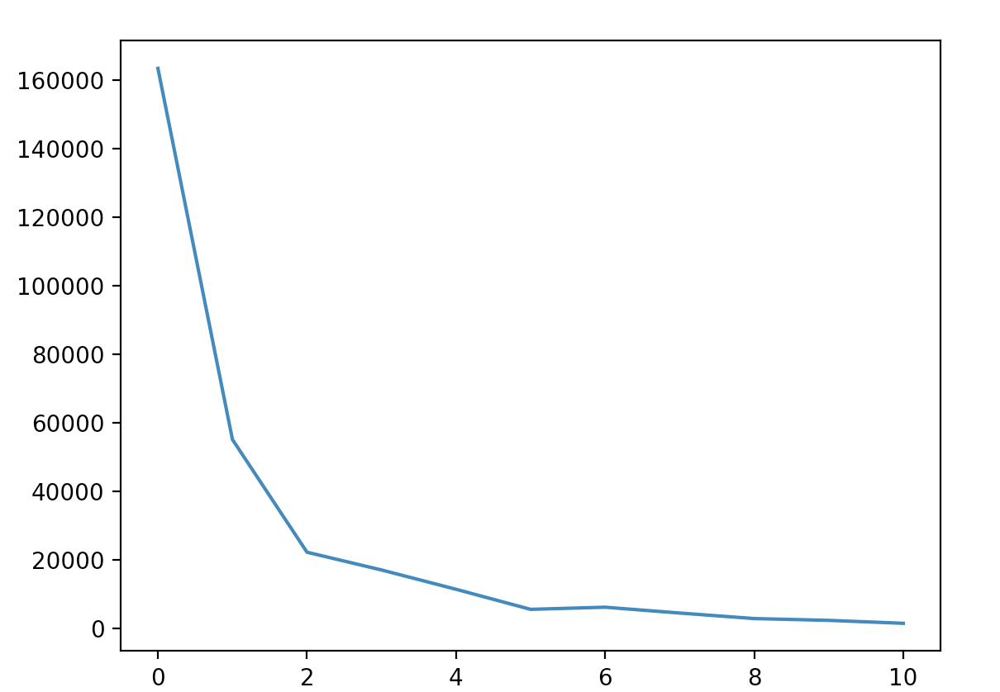 

The image on the left is the real image, and the right one is the image generated by KMeans algorithm, every black dot is the centroid calculated by the algorithm.

| Real image | Image with centroids generated | 
| --- | --- |
| 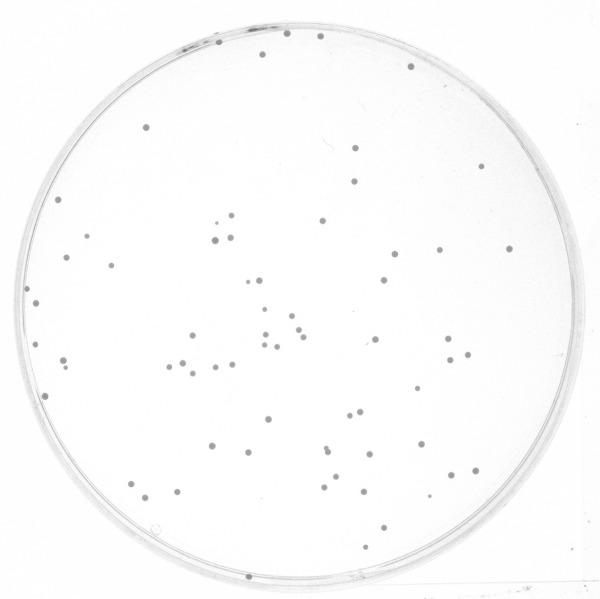 | 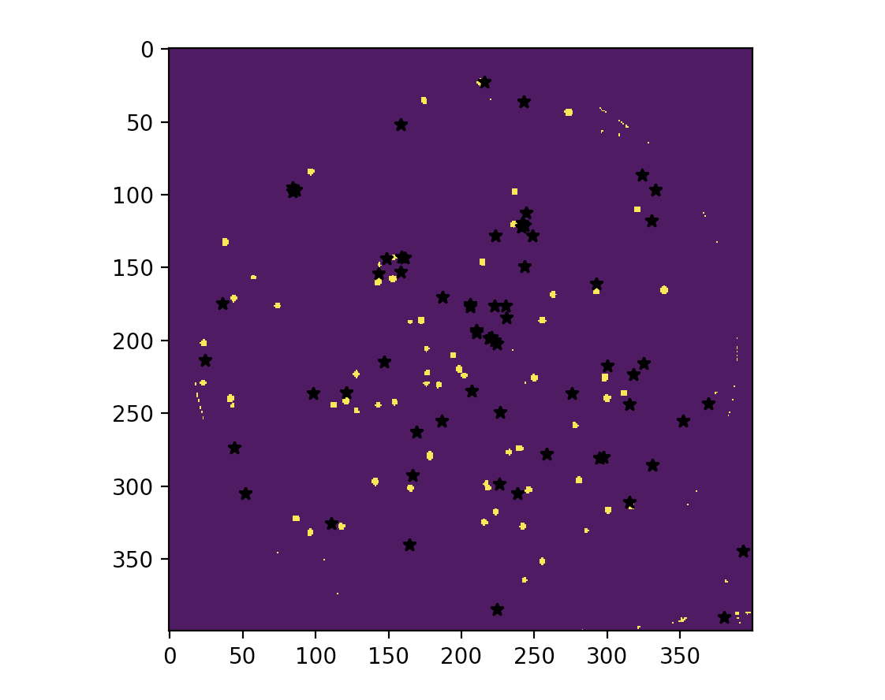 | 

### CNN

The next method we used is CNNs. To predict, preprocessed data can be fed into a stack of convolution layers that have been trained to learn features that define what it means to be a colony. The result from these can then be fed into several fully connected layers that use these features to determine how many colonies there are. 

The structure of the model that we found worked best was:

| Layer 1 (C) | 3 filters in | 7 filters out | 5x5 filter |
| Layer 2 (C)| 7 filters in |20 filters out| 5x5 filter|
| Layer 3 (FC)| 128 nodes out || |
| Layer 4 (FC)| 32 nodes out || |
| Layer 5 (FC)| 1 node out || |

* FC = fully connected

* C = convolutional

This model was surprising as one would expect more filters in the first layers, however, after manually trying many different approaches this was the one that gave the best results on the validation set. An important note to make is that the CNN was trained on the data generator mentioned above, which was normalized, both w.r.t the images and colony counts. The model was trained on 3,000 generated images and its performance was measured on 150 (different) generated images.

### Boosting

Boosting is a meta algorithm that exploits the weaknesses of multiple algorithms to create a stronger learner. In this case, our two algorithm are kmeans and CNN, as such we concatenate the results from the kmeans and CNN to form the input data for our boosting algorithm. Since we are trying to predict a quantity, this isn’t a classification problem but a regression problem. Utilizing python’s sklearn Gradient Boosting Regressor, we find that the overall error for boosting is slightly higher than that of just kmeans, but with more models or a more effective CNN we can improve theses results.

## Results

Our results are summarized below. In the first table are our predictions for our two models-kMeans and CNN-and the combined results after using gradient boosting regression. From boosting, we found that the kmeans model had much more weight (0.96) in comparison to CNN (0.04). The difference in weight is due to the predictive accuracy of each model. Kmeans performed better than CNN in predicting the colony images. The CNN model seems to perform better at lower colony counts, but fails at higher numbers on real colony images. We expected this failure from CNN because we did not have enough real colony images to train CNN and instead it was trained on generated images. The second table below summarizes the performance of each of the models by comparing their root mean square error to the “true” count predictions (Open CFU counts). 

  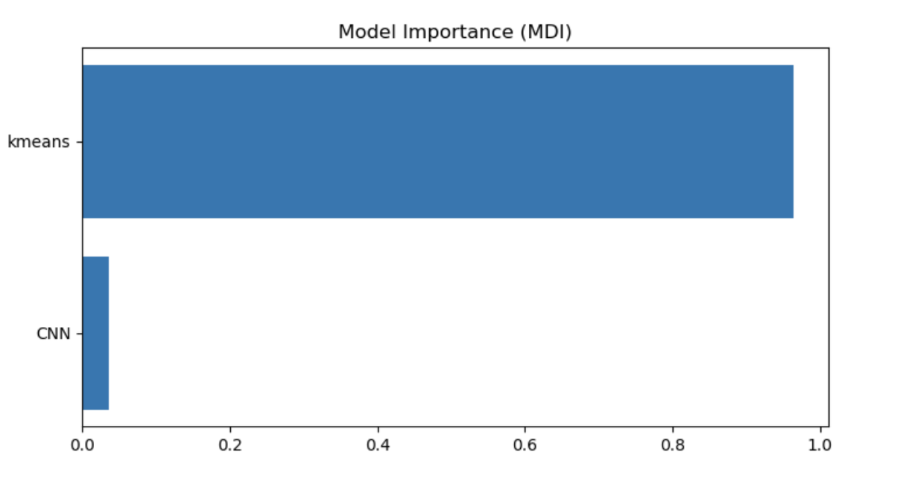

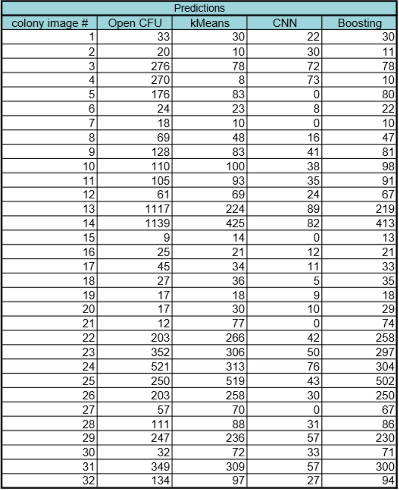

  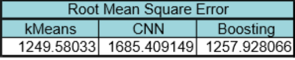

## Conclusion and Future Work

We see that overall, the kMeans model performed the best. However, this conclusion should be taken with a grain of salt considering that (i) we did not train CNN on actual colony images, instead on generated ones and (ii) our validation data set was very small (32 images). Our algorithm can be improved by training CNN on many real colony images. We would expect CNN to outperform kMeans and shift the weighting in its favor in gradient regression boosting. We will work to improve our algorithm by gathering more colony images to train CNN. This is because the CNN performed very well on a generated validation set that it had not seen, but failed to generalize for the most part to the colony images. Finally, another suggestion to improve upon our algorithm is to input more methods to count colonies. To this end, we will implement a support vector machine-based method to colony count.  Another suggestion is to expand the structure of a CNN to allow for a better ability to count. While there are models that heavily rely on CNNs to count (e.g. create bounding boxes of objects and then count them), they generally require many layers and heavy modifications. It is our recommendation to extend convolutional filters to capture more “information” to count.  

## References

1.  W.-B. Chen, C. Zhang, An automated bacterial colony counting and classification system. Information Systems Frontiers 11, 349-368 (2009).
2.  S. D. Brugger et al., Automated Counting of Bacterial Colony Forming Units on Agar Plates. PLOS ONE 7, e33695 (2012).
3.	Ferrari, Alessandro et al., Bacterial colony counting with convolutional neural networks in digital microbiology imaging Pattern Recognition 61, 629-640 (2017). 

## Contribution

* Jihyun Park- Preprocessing, Boosting, Github page

* Edward Bateh - Preprocessing, kMeans, Github page

* Jackson Harmon - CNN, preprocessing, Github page

* Yang Zhang - Preprocessing, kMeans, Github page, Colony generation

* Weiyao Tang - Preprocessing, kMeans, Github page

Github page:
https://tang111111.github.io/ColonyCountingML/
